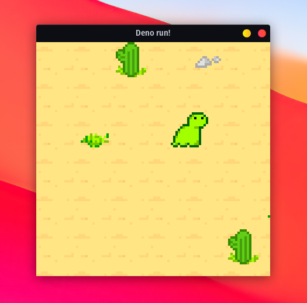

### Deno SDL2

deno_sdl2 provides cross-platform bindings to sdl2, sdl2_ttf and sdl2_image.

<p align="center">
  
</p>

### get started

```typescript
import {
  EventType,
  WindowBuilder,
} from "https://deno.land/x/sdl2/src/canvas.ts";

const window = new WindowBuilder("Hello, Deno!", 640, 480).build();
const canvas = window.canvas();

for (const event of window.events()) {
  if (event.type == EventType.Quit) {
    break;
  } else if (event.type == EventType.Draw) {
    // Rainbow effect
    const r = Math.sin(Date.now() / 1000) * 127 + 128;
    const g = Math.sin(Date.now() / 1000 + 2) * 127 + 128;
    const b = Math.sin(Date.now() / 1000 + 4) * 127 + 128;
    canvas.setDrawColor(Math.floor(r), Math.floor(g), Math.floor(b), 255);
    canvas.clear();
    canvas.present();
  }
}
```

```shell
~> deno run --allow-ffi --unstable https://deno.land/x/sdl2/examples/hello.ts
```

### installing sdl2

Follow https://wiki.libsdl.org/Installation to install the dynamic library.
`deno_sdl2` will use various methods to figure our the installation path.

TL;DR

MacOS (arm64/x64):

```shell
brew install sdl2 sdl2_image sdl2_ttf
```

Windows (x64): Grab one of the prebuilt libraries from
https://buildbot.libsdl.org/sdl-builds/sdl-visualstudio-x86/ and put
`lib/SDL2.dll` into the root of your project.

Linux (x64):

```shell
sudo apt install sdl2 sdl2_image sdl2_ttf
```

### security

you need `--allow-ffi --unstable` to use SDL2. `deno_sdl2` needs access to
system's SDL2 library. Deno's permission model does not work well with FFI
libraries, use at your own risk.

### projects using `deno_sdl2`

- https://github.com/dhairy-online/dino-deno
- https://github.com/dhairy-online/flappybird
- https://github.com/load1n9/caviar

- ...insert your project here

### license

MIT
